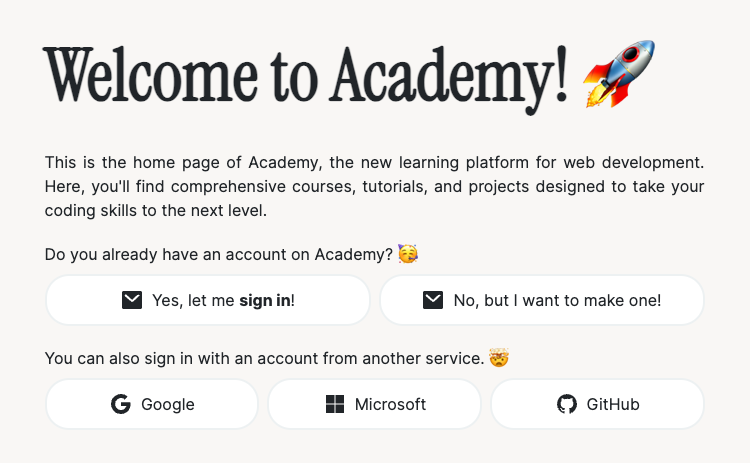
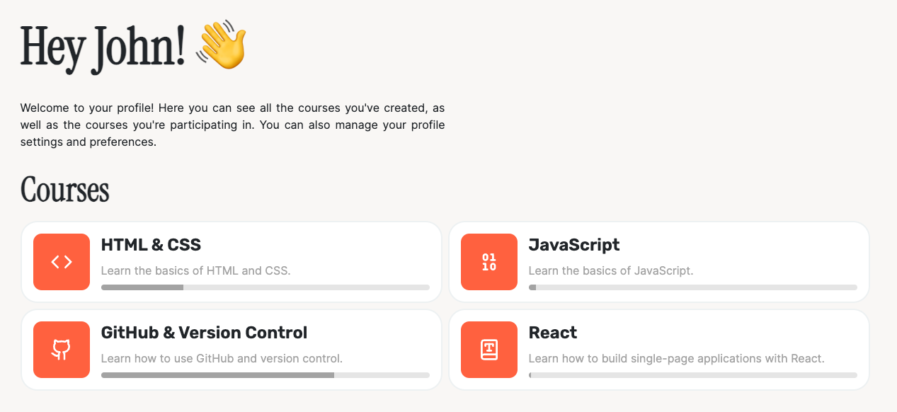

# Open Course Tool

This is the repository for the Open Course Tool (or Academy), a web application that allows users to create, manage, and share their own courses.

Everything is very much in development.

## Technologies

- Frontend
  - React with TypeScript
  - TailwindCSS
  - Shadcn/ui
- Backend
  - Bun with TypeScript

## Login Page

## Profile Page
